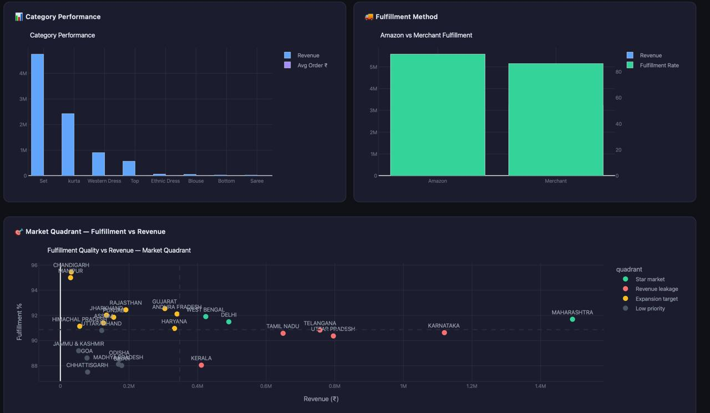
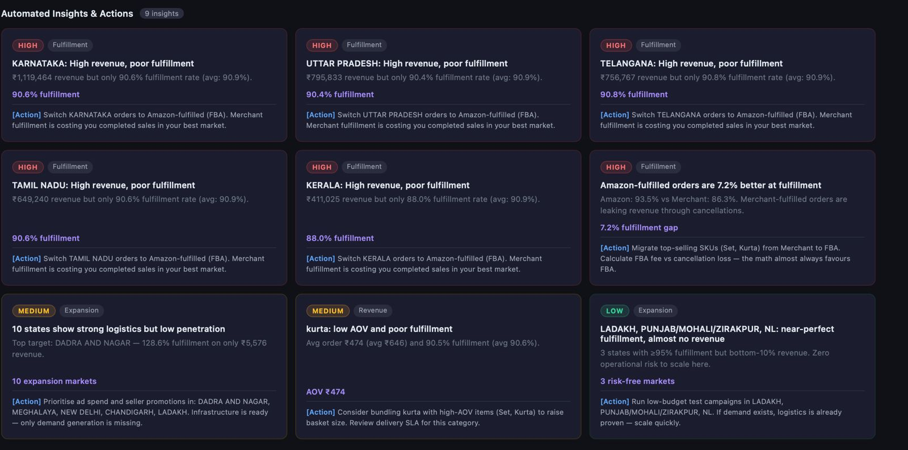
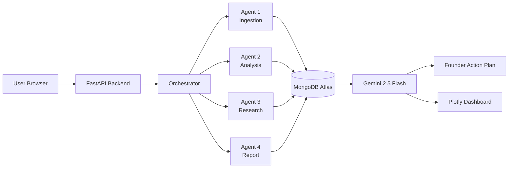

# Revenue Intelligence 

> **4 AI Agents that turn any sales CSV into a founder-ready action plan.**

[](https://cloud.google.com)
[](https://mongodb.com)
[](https://ai.google.dev)
[](https://render.com)
[](LICENSE)

**Live Demo:** https://data-driven-profitability-and-market.onrender.com

**Track:** Google Cloud Rapid Agent Hackathon · MongoDB Partner Prize

---

## The Problem

Indian D2C founders selling on Amazon, Flipkart, Shopify, and Meesho generate thousands of rows of sales data every month — but have no visibility into what's actually happening.

- Which products are silently losing revenue?
- Which states have perfect fulfillment but zero marketing spend?
- Are competitors undercutting prices in high-volume categories?
- What should be fixed *first* to maximize growth?

Hiring a business analyst costs ₹50,000+ per month. Most founders fly blind.

**Revenue Intelligence automates the entire analysis pipeline in minutes.**

---

## The Solution

Upload any sales CSV → 4 AI agents chain together → receive a complete founder action plan with charts, insights, and competitor research.




---

# Architecture


---

## Agent Pipeline

### Agent 1 — Ingestion Agent
Reads the uploaded CSV, auto-detects marketplace format (Amazon, Flipkart, Shopify, Meesho), cleans and standardizes the data, and computes 18 business KPIs including total revenue, AOV, fulfillment rate, B2B share, revenue by state, and category performance.

**MongoDB Output:** `cleaned_orders`, `kpis`

---

### Agent 2 — Analysis Agent
Reads KPI data and runs 5 detection engines to surface revenue decline, weak-performing states, product concentration risk, fulfillment issues, and category underperformance. Every insight is tagged with a severity level (Critical / High / Medium / Low) and a specific action.

**MongoDB Output:** `insights`

---

### Agent 3 — Research Agent *(Gemini 2.5 Flash Lite + Google Search Grounding)*
Takes the top 5 high-severity insights and uses Gemini with live Google Search grounding to research competitor pricing, industry benchmarks, market trends, and growth opportunities specific to the Indian D2C market.

**MongoDB Output:** `research`

---

### Agent 4 — Report Agent *(Gemini 2.5 Flash Lite)*
Reads KPIs, insights, and research, then generates a comprehensive founder action plan — prioritized, specific, and written in plain language a non-technical founder can act on immediately.

**MongoDB Output:** `reports`

---

## MongoDB as Shared Agent Memory

| Collection       | Written By | Read By              |
|------------------|------------|----------------------|
| uploads          | FastAPI    | Agent 1              |
| cleaned_orders   | Agent 1    | Agent 2              |
| kpis             | Agent 1    | Agent 2, Agent 4     |
| insights         | Agent 2    | Agent 3, Agent 4     |
| research         | Agent 3    | Agent 4              |
| reports          | Agent 4    | Dashboard            |
| processing_jobs  | All Agents | Status API           |

MongoDB Atlas acts as the shared memory layer between all agents — each agent reads the previous agent's output and writes its own, enabling a clean sequential pipeline with full traceability.

**MCP Server URL:** `https://data-driven-profitability-and-market.onrender.com/mcp`

---

## Tech Stack

| Layer               | Technology                        | Purpose                        |
|---------------------|-----------------------------------|--------------------------------|
| Backend             | FastAPI + Uvicorn                 | Async API server               |
| AI Model            | Gemini 2.5 Flash Lite             | Research & Report Generation   |
| Search Grounding    | Google Search (Gemini tool)       | Live competitor research       |
| Agent Orchestration | Google Cloud Agent Builder        | Multi-agent workflow           |
| Agent Context       | MongoDB MCP Server                | Context injection into agents  |
| Database            | MongoDB Atlas (M0, Mumbai)        | Shared agent memory            |
| Analytics           | Pandas + custom KPI engine        | Data processing (18 KPIs)      |
| Visualization       | Plotly                            | Interactive dashboard charts   |
| Authentication      | bcrypt + itsdangerous             | Secure sessions                |
| Payments            | Razorpay                          | Subscription billing           |
| Deployment          | Render (Python 3.11)              | Cloud hosting                  |

---

## Key Features

- **Auto CSV Detection** — works with Amazon, Flipkart, Shopify, Meesho, or any sales format
- **18 KPIs computed** — revenue, AOV, fulfillment rate, B2B share, state breakdown, category performance
- **31 insight detectors** — flags revenue drops, weak markets, concentration risk, fulfillment issues
- **Live Google Search grounding** — Agent 3 grounds competitor research in real web data
- **Founder action plan** — Gemini generates a prioritized, plain-language report
- **MongoDB agent memory** — full pipeline traceability across all 6 collections
- **MCP server integration** — registered in Google Cloud Agent Builder registry

---

## Local Setup

### 1. Clone Repository

```bash
git clone https://github.com/TwinedM/Data-Driven-Profitability-and-Market-Expansion-Decision-System.git
cd Data-Driven-Profitability-and-Market-Expansion-Decision-System
git checkout feature/agentic-mongodb-pipeline
```

### 2. Install Dependencies

```bash
pip install -r app/requirements.txt
```

### 3. Configure Environment Variables

Create a `.env` file:

```env
MONGODB_URI=your_mongodb_atlas_uri
MONGODB_DB=revenue_intel
GEMINI_API_KEY=your_gemini_api_key
SECRET_KEY=your_secret_key
```

### 4. Run Application

```bash
uvicorn app.main:app --reload --port 8000
```

### 5. Open Browser
http://localhost:8000

Upload the sample CSV from the repository to run the full 4-agent pipeline.

---

## Team

| Name    | GitHub                                                    | Role                                        |
|---------|-----------------------------------------------------------|---------------------------------------------|
| Devansh | [@gitdev77](https://github.com/gitdev77)                 | Backend, Agent Pipeline, Deployment         |
| Medha   | [@medhasharma2805](https://github.com/medhasharma2805)   | Analysis Worker, Report Worker, Docs        |
| Peeuesh | [@TwinedM](https://github.com/TwinedM)                   | Research Worker, MongoDB Integration        |

---

## License

MIT License — see [LICENSE](LICENSE) for details.

---

*Built for Indian D2C Founders · Google Cloud Rapid Agent Hackathon 2026*